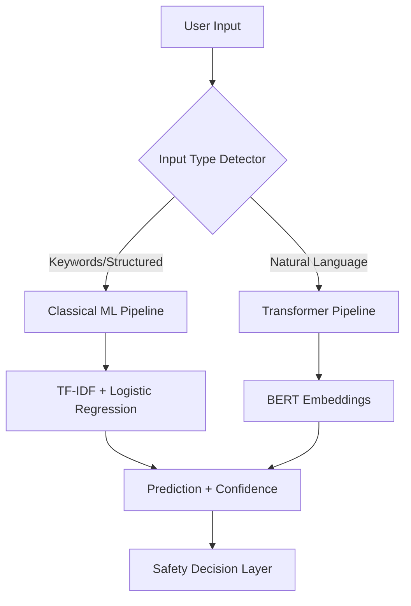
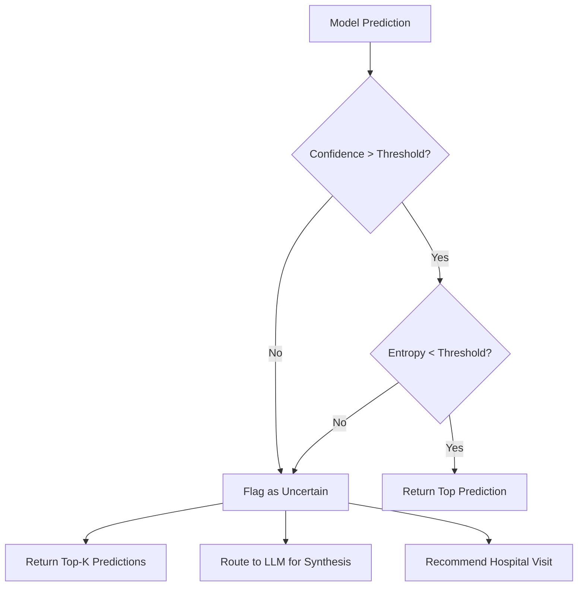
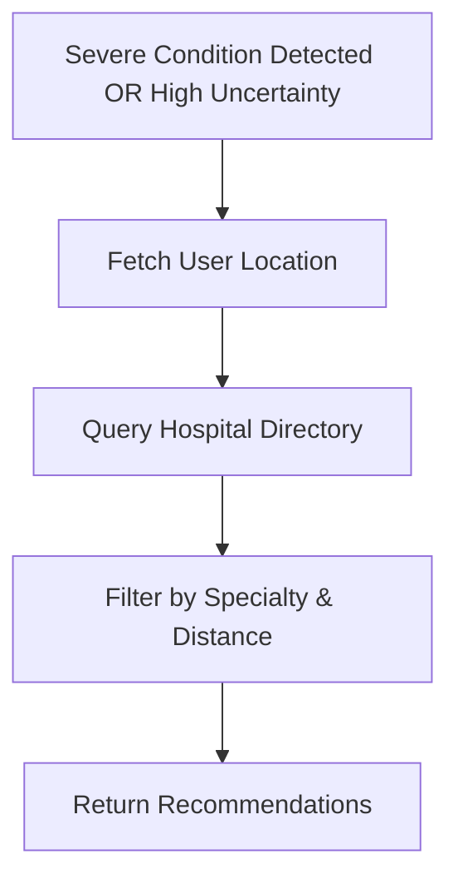
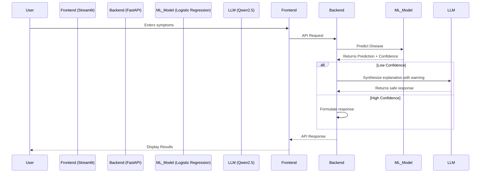

# 🏛️ MediAssist AI Architecture Documentation

## 🔍 System Overview
MediAssist AI is a hybrid, safety-aware healthcare assistant designed for low-resource environments. It combines classical machine learning for speed and interpretability, transformer models for deep semantic understanding, and local Large Language Models (LLMs) for conversational synthesis.

The system prioritizes **safety** over raw accuracy by implementing an uncertainty-aware decision layer that flags unreliable predictions and suggests multiple possibilities (Top-K) instead of a single risky output.

---

## 🗺️ Hybrid Routing Pipeline

The system uses a smart routing mechanism to handle different types of user inputs (e.g., keyword lists vs. natural language descriptions).

---

## 🛡️ Safety-Aware Decision Layer

The safety layer evaluates the model's prediction confidence and uncertainty (entropy, top-2 gap) to determine the output strategy.

### Key Components:
1.  **Confidence Thresholding**: Predictions with low probability are flagged.
2.  **Uncertainty Estimation**: Uses entropy of the probability distribution to detect when the model is confused between multiple classes.
3.  **Top-K Predictions**: Instead of forcing a single answer, the system returns the top 3 most likely conditions.

---

## 🏥 Hospital Recommendation Engine

When uncertainty is high or specific severe conditions are detected, the system suggests appropriate healthcare facilities.

---

## 🔄 Component Interaction

---

## 📁 Folder Structure (Docs)
- `README.md`: This file.
- `component_details.md`: Detailed explanation of each module (to be created).
- `data_flow.md`: Detailed data flow diagrams (to be created).
