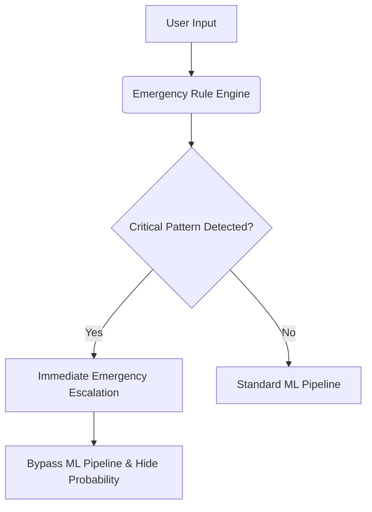
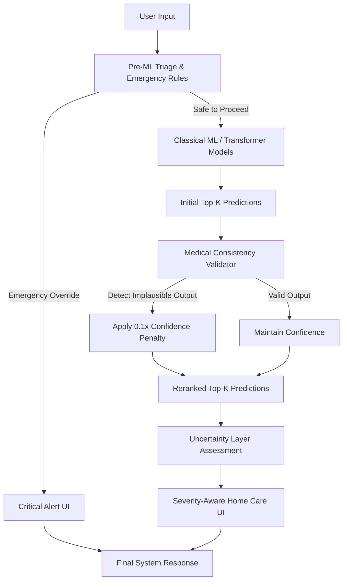

# MediAssist AI: Safety-Aware Architecture Diagrams

## 1. Emergency Detection Flowchart

```mermaid
graph TD
    A[User Input] --> B(Emergency Rule Engine)
    B --> C{Critical Pattern Detected?}
    C -- Yes --> D[Immediate Emergency Escalation]
    D --> E[Bypass ML Pipeline & Hide Probability]
    C -- No --> F[Standard ML Pipeline]
```

## 2. Full Safety Architecture Diagram

```mermaid
graph TD
    A[User Input] --> B[Pre-ML Triage & Emergency Rules]
    B --> |Emergency Override| C[Critical Alert UI]
    B --> |Safe to Proceed| D[Classical ML / Transformer Models]
    D --> E[Initial Top-K Predictions]
    E --> F[Medical Consistency Validator]
    F --> |Detect Implausible Output| G[Apply 0.1x Confidence Penalty]
    F --> |Valid Output| H[Maintain Confidence]
    G --> I[Reranked Top-K Predictions]
    H --> I
    I --> J[Uncertainty Layer Assessment]
    J --> K[Severity-Aware Home Care UI]
    C --> L[Final System Response]
    K --> L
```
